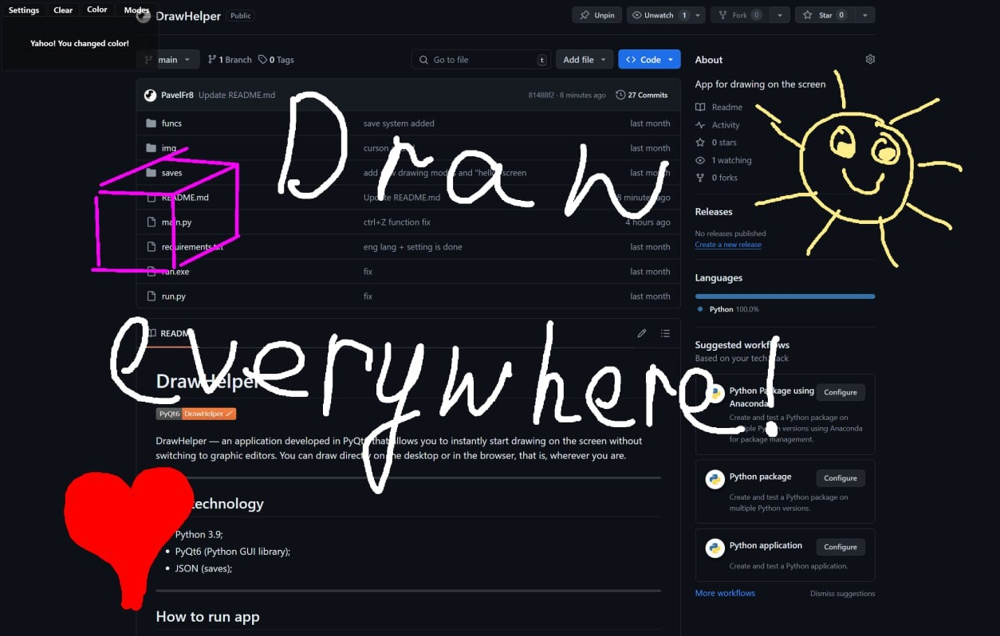

# 🎨 DrawHelper — Your Handy Drawing Assistant by PavelFr8




Hey there! Welcome to **DrawHelper** — a desktop app designed to help you sketch, annotate, and create visual notes with ease.

Built with pure PyQt6, DrawHelper is perfect for quick drawings, simple diagrams, or just unleashing your creativity =)

> 🖥️ **Platform:** Windows desktop app, easy to install and use.

---

## 🚀 Features

* ✏️ Multiple drawing tools: freehand pencil, straight line, circle, eraser
* 🌙 Dark-friendly interface
* ⚡ Customizable transparent background

---

## 📦 Installation & Running

### Requirements

* Windows 10 or newer
* Python 3.12+ (if running from source)
* PyQt6 (if running from source)

---

### Running from Source

1. Clone this repository:

   ```bash
   git clone https://github.com/PavelFr8/DrawHelper
   cd DrawHelper
   ```

2. Create and activate a virtual environment:

   ```bash
   python -m venv venv
   .\venv\Scripts\activate
   ```

3. Install dependencies:

   ```bash
   pip install -r requirements.txt
   ```

4. Run the app:

   ```bash
   python3 drawhelper\main.py  
   ```

---

### Running from Installer (Windows)

1. Download the latest release from the [Releases page](https://github.com/PavelFr8/DrawHelper/releases)
2. Run the installer `.exe` file
3. Choose install directory (default is `%AppData%\DrawHelper`)
4. Select if you want a desktop shortcut
5. Launch DrawHelper from Start Menu or desktop shortcut

---

## 🛠 Project Structure

```
├── drawhelper
│   ├── main.py
│   ├── utils
│   └── widgets
│       ├── drawing_widget.py
│       ├── main_widget.py
│       └── menu_widget.py
├── imgs
├── installer.iss
├── pyproject.toml
├── requirements.txt
├── LICENSE
└── README.md
```

## 🤝 Contributing

* ⭐ Star this repo if you find it useful
* 🐞 Report bugs via Issues
* 🧑‍💻 Send Pull Requests with new features or fixes — contributions are welcome!

---

> 🎨 Thanks for checking out DrawHelper!
> Hope it makes your drawing tasks smoother and more enjoyable.
