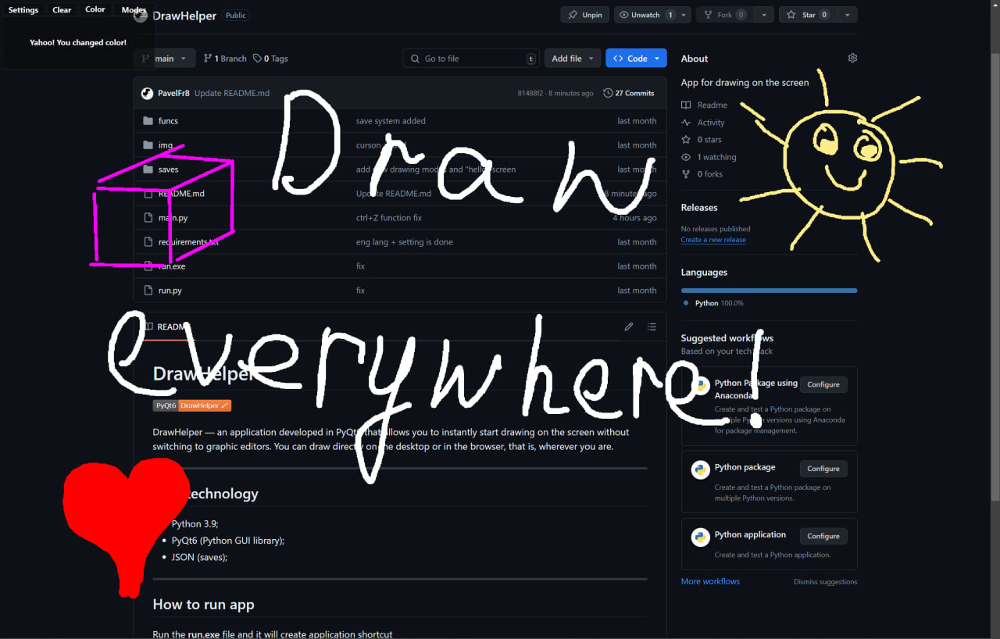

# DrawHelper


DrawHelper — an application developed in PyQt6 that allows you to instantly start drawing on the screen without switching to graphic editors. You can draw directly on the desktop or in the browser, that is, wherever you are.



<hr>

## User technology

* Python 3.9;
* PyQt6 (Python GUI library);
* JSON (saves);

<hr>

## How to run app

Run the **run.exe** file and it will create application shortcut

OR

Install the requirements.txt

```ubuntu
$ python3 pip instal -r requirements.txt
```

Run app

```ubuntu
$ python3 run.py
```
